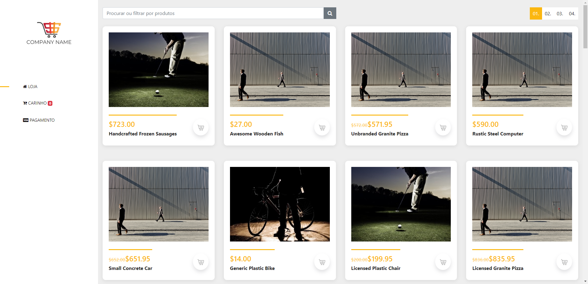
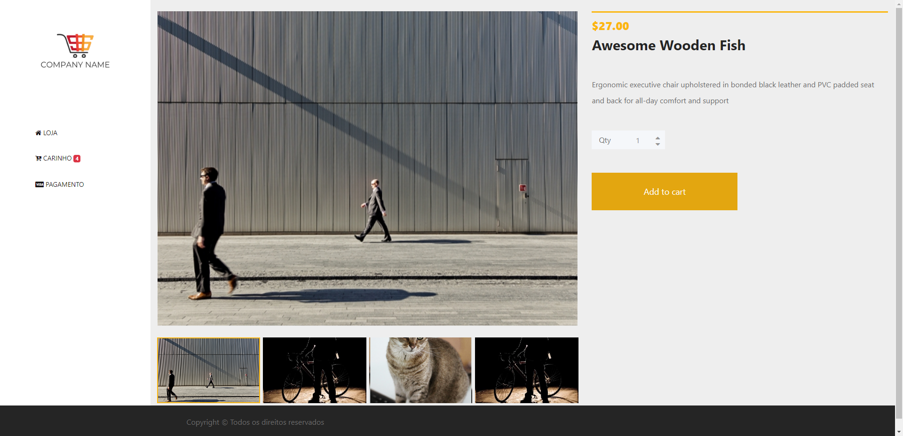
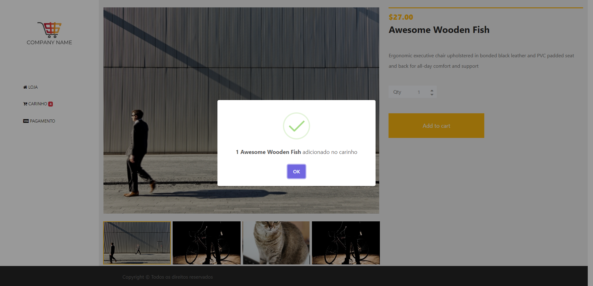
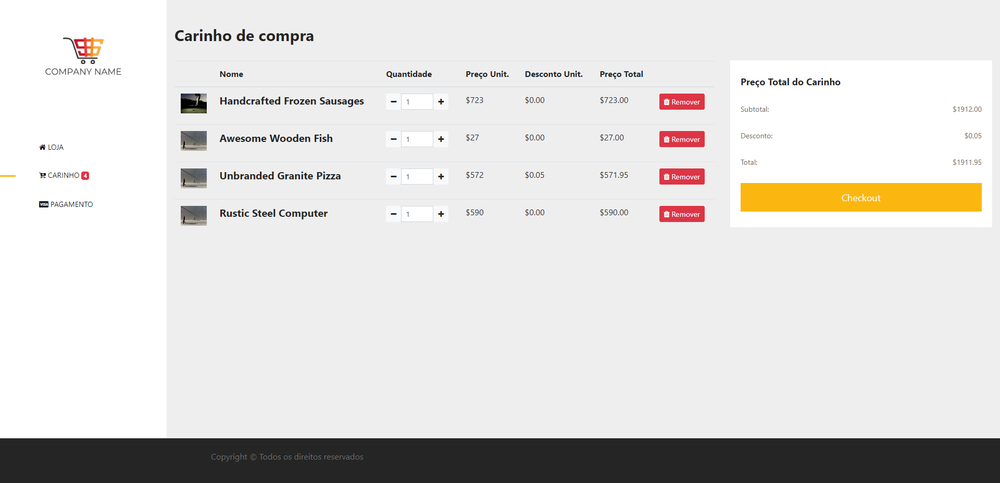
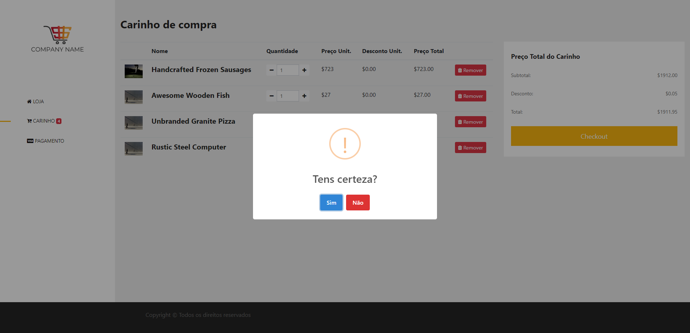
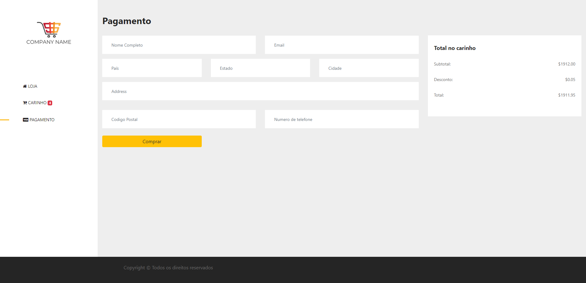

### Instalação do projeto

Intalar dependencia do projeto
```
npm install
```
Adicionar informação da api backend em .env
```
#.env file
REACT_APP_API_URL = "http://127.0.0.1:8000/api"
```
Iniciar o servidor
```
npm start
```
Abrir o link [http://localhost:3000](http://localhost:3000)

### Guia do uso da aplicação
A loja foi feito com o React JS













### Proximos passos
- [ ] Login do cliente
- [ ] Paginação no Produto


